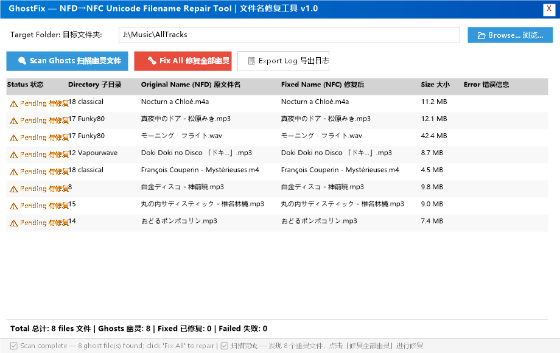
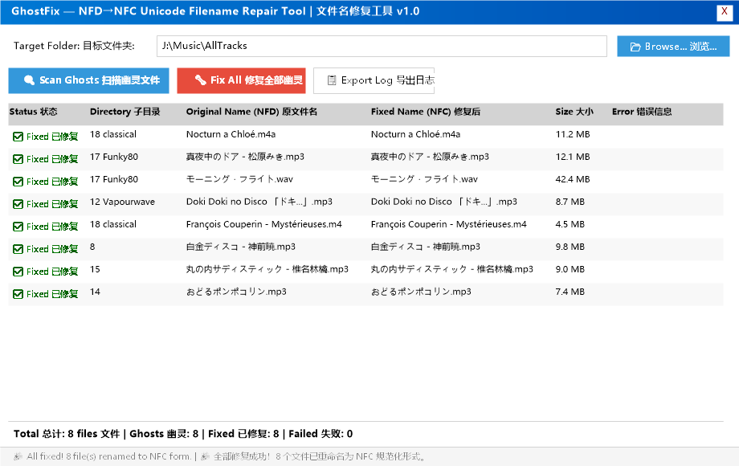

# 👻 GhostFix — NFD→NFC Unicode Filename Repair Tool | Unicode 文件名修复工具

[](https://github.com/cyberflax2020/GhostFix)
[](https://github.com/cyberflax2020/GhostFix)
[](LICENSE)
[](https://github.com/cyberflax2020/GhostFix/releases)

> A Windows GUI tool that recursively scans and repairs ghost files — filenames corrupted by **NFD (decomposed) Unicode encoding** caused by the Tuxera NTFS driver on macOS, rendering files inaccessible.
>
> 一款 Windows GUI 工具，递归扫描并修复因 macOS Tuxera NTFS 驱动导致的 **NFD 分解式 Unicode 文件名编码**问题（俗称"幽灵文件"），使文件在 macOS 上恢复正常访问。

---

## 📖 Table of Contents | 目录

- [Problem | 问题](#-problem--问题)
- [Screenshots | 截图](#-screenshots--截图)
- [Installation | 安装](#-installation--安装)
- [Usage | 使用](#-usage--使用)
- [How It Works | 原理](#-how-it-works--原理)
- [Safety | 安全性](#-safety--安全性)
- [FAQ | 常见问题](#-faq--常见问题)
- [Project Structure | 项目结构](#-project-structure--项目结构)
- [License | 许可证](#-license--许可证)

---

## 🎯 Problem | 问题

### The Ghost File Phenomenon | 幽灵文件现象

When an NTFS-formatted external drive is used on macOS via the **Tuxera NTFS** driver, filenames containing diacritics or CJK characters are written in **NFD (Normalization Form D — decomposed)** form instead of **NFC (Normalization Form C — composed)**:

当 NTFS 格式的外置硬盘通过 **Tuxera NTFS** 驱动在 macOS 上使用时，含变音符或中日韩（CJK）字符的文件名会被以 **NFD（Normalization Form D — 分解形式）** 写入，而非 **NFC（Normalization Form C — 预组合形式）**：

| Character 字符 | NFC (Correct 正确) | NFD (Corrupted 损坏) |
|-----------|---------------|-----------------|
| **é** | `U+00E9` (1 codepoint 1个码点) | `U+0065` + `U+0301` (2 codepoints 2个码点) |
| **ド** | `U+30C9` (1 codepoint 1个码点) | `U+30C8` + `U+3099` (2 codepoints 2个码点) |
| **ü** | `U+00FC` (1 codepoint 1个码点) | `U+0075` + `U+0308` (2 codepoints 2个码点) |

**Symptom on macOS | macOS 上的症状：**
```
$ ls        → ✅ File is listed 文件可见
$ stat      → ❌ No such file or directory 无此文件或目录
$ ffprobe   → ❌ Cannot read 无法读取
$ Finder    → ❌ Cannot open 无法打开
```

The file **exists on disk** and the data is intact, but the NFD-encoded path is **unreachable** through Tuxera's driver layer.

文件**在磁盘上确实存在**且数据完好，但 NFD 编码的路径经 Tuxera 驱动层**无法访问**。

---

## 📸 Screenshots | 截图

### Scan: Detecting Ghost Files | 扫描：检测幽灵文件


### Fix: All Repaired | 修复：全部修复完成


---

## 📦 Installation | 安装

### Requirements | 系统要求

- **Windows 10** or **Windows 11** | **Windows 10** 或 **Windows 11**
- **PowerShell 5.1+** (built-in, no installation needed) | **PowerShell 5.1+**（系统自带，无需安装）
- **No third-party dependencies** | 零第三方依赖

### Download | 下载

```bash
git clone git@github.com:cyberflax2020/GhostFix.git
```

Or download the latest release ZIP from [Releases](https://github.com/cyberflax2020/GhostFix/releases).

或从 [Releases](https://github.com/cyberflax2020/GhostFix/releases) 下载最新发行版 ZIP 压缩包。

### Launch | 启动

```
Double-click 双击:   启动GhostFix.bat
        OR 或:   Right-click GhostFix.ps1 → Run with PowerShell
                 右键 GhostFix.ps1 → 使用 PowerShell 运行
```

---

## 🚀 Usage | 使用

### 3-Step Workflow | 三步操作

| Step 步骤 | Action 操作 | Description 说明 |
|------|--------|-------------|
| **1** | 📂 **Select** folder 选择文件夹 | Choose the target directory (e.g., SD card music folder) 选择目标目录（如 SD 卡上的音乐文件夹） |
| **2** | 🔍 **Scan** 扫描 | Recursively find all NFD-encoded filenames 递归查找所有 NFD 编码的文件名 |
| **3** | 🔧 **Fix** 修复 | One-click rename all ghosts to NFC-normalized form 一键将所有幽灵文件重命名为 NFC 规范形式 |

### Keyboard Shortcuts | 快捷键

| Key 按键 | Action 功能 |
|-----|--------|
| `Ctrl + F` | Start scan 开始扫描 |
| `Ctrl + R` | Start fix 开始修复 |
| `Ctrl + S` | Export log 导出日志 |

### Export Formats | 日志导出格式

- **CSV** — Open in Excel 可用 Excel 打开
- **JSON** — Programmatic processing 供程序化处理
- **TXT** — Human-readable plain text 便于人工阅读的纯文本

---

## ⚙️ How It Works | 原理

### Detection Algorithm | 检测算法

```powershell
# Core detection — Ordinal comparison | 核心检测 — Ordinal（序数）比较
$nfc = $filename.Normalize([System.Text.NormalizationForm]::FormC)
$isGhost = -not [string]::Equals($filename, $nfc, [StringComparison]::Ordinal)
```

If `filename ≠ NFC(filename)` → the filename is in **NFD decomposed form** → needs repair.

若 `文件名 ≠ NFC(文件名)` → 文件名当前为 **NFD 分解形式** → 需要修复。

### Fix Operation | 修复操作

```powershell
Rename-Item -LiteralPath <NFD_path NFD路径> -NewName <NFC_normalized_name NFC规范文件名>
```

`Rename-Item` is an **atomic operation** on NTFS — it either fully succeeds or fully fails, never a partial state.

`Rename-Item` 在 NTFS 上是**原子操作**——要么完全成功，要么完全失败，绝不会产生中间状态。

### Why Windows? | 为什么在 Windows 上修复？

- **Windows** uses NTFS natively → NFD-encoded paths ARE accessible | **Windows** 原生使用 NTFS → NFD 编码路径**可以**正常访问
- **macOS + Tuxera** → NFD paths are ghosted (driver bug) | **macOS + Tuxera** → NFD 路径变成幽灵（驱动 bug）
- Fix on Windows → drive works on both platforms | 在 Windows 上修复 → 硬盘在两个平台均可正常使用

---

## 🔒 Safety | 安全性

| Guarantee 保证 | Detail 详情 |
|-----------|--------|
| **Content-safe** 内容安全 | Only renames the file; file content is **never modified** 仅重命名文件，文件内容**绝不会被修改** |
| **Atomic** 原子性 | NTFS rename is atomic — no intermediate broken state NTFS 重命名为原子操作——不存在中间损坏状态 |
| **Selective** 选择性 | Only touches files with NFD encoding; ASCII/normal files are **never affected** 只处理 NFD 编码文件；ASCII/正常文件**绝不受影响** |
| **Logged** 可记录 | Every operation is logged; exportable for audit 所有操作均被记录，可导出供审计 |

### Before/After Verification | 操作前后验证

```
Before 修复前:  Nocturn a Chloé.m4a  (NFD, macOS: ❌ inaccessible 无法访问)
After  修复后:  Nocturn a Chloé.m4a  (NFC, macOS: ✅ accessible 正常访问)

$ sha256sum before after   → identical (content unchanged) 完全一致（内容未变）
```

---

## ❓ FAQ | 常见问题

### Q: Will this affect my normal files? | 会影响正常文件吗？
**A:** No. GhostFix only touches files whose names differ between NFC and NFD forms (Ordinal comparison). Pure ASCII or already-NFC files are **completely skipped**.

**答：** 不会。GhostFix 只处理 NFC 与 NFD 形式不同的文件名（Ordinal 比较）。纯 ASCII 或已是 NFC 形式的文件**完全跳过**。

### Q: Can I undo the fix? | 能撤销吗？
**A:** To undo, simply rename the files back to NFD form. However, this would re-create the macOS accessibility problem. The fix is a standard NFC normalization — what Windows and modern macOS use by default.

**答：** 可以，把文件名改回 NFD 形式即可撤销。但这会重新产生 macOS 上的访问问题。修复所用的 NFC 规范化是标准做法——Windows 与现代 macOS 默认使用的正是它。

### Q: Does it work on macOS? | 能在 macOS 上运行吗？
**A:** No. GhostFix must run on Windows because the macOS Tuxera driver **cannot even access** the ghost files to rename them. Fix on Windows → use anywhere.

**答：** 不能。GhostFix 必须在 Windows 上运行，因为 macOS 的 Tuxera 驱动**根本无法访问**幽灵文件，也就无法重命名。在 Windows 上修复 → 到处可用。

### Q: Is it only for music files? | 只支持音乐文件吗？
**A:** No. GhostFix works on **all file types** — documents, images, videos, archives, anything. It only checks the filename encoding, not the content.

**答：** 不是。GhostFix 支持**所有文件类型**——文档、图片、视频、压缩包等等。它只检查文件名编码，不关心文件内容。

### Q: Why does this problem happen? | 为什么会发生这个问题？
**A:** macOS's filesystem layer historically uses NFD internally, while Windows/NTFS uses NFC. The **Tuxera NTFS driver** (third-party) has a long-standing bug where it fails to properly translate between these forms during path resolution, creating "ghost" directory entries.

**答：** macOS 的文件系统层历史上内部使用 NFD，而 Windows/NTFS 使用 NFC。**Tuxera NTFS 驱动**（第三方）存在一个长期 bug：路径解析时未能在这两种形式之间正确转换，从而产生"幽灵"目录项。

---

## 📂 Project Structure | 项目结构

```
GhostFix/
├── GhostFix.ps1                 ← Main application 主程序
├── 启动GhostFix.bat              ← One-click launcher 一键启动脚本
├── 用户文档.md                    ← Bilingual user manual 双语用户手册
├── README.md                    ← This file 本文件
├── LICENSE                      ← MIT license (EN + ZH) MIT 许可证（英文 + 中文）
├── .gitignore
├── screenshots/                 ← UI screenshots 界面截图
│   ├── 01_scan_result.png       ← Scan result 扫描结果
│   └── 02_fix_complete.png      ← Fix complete 修复完成
├── scripts/
│   └── generate_screenshots.ps1 ← Screenshot generator 截图生成脚本
└── test/                        ← Local NFD test data (gitignored, removable)
                                   本地 NFD 测试数据（已被 git 忽略，可删除）
```

---

## 📄 License | 许可证

MIT © [cyberflax2020](https://github.com/cyberflax2020)

See the [LICENSE](LICENSE) file for the full text (English original with an unofficial Chinese translation).

完整文本见 [LICENSE](LICENSE) 文件（英文原文附非官方中文译文）。

---

*Made with ❤️ for the music collector who just wants their files to work everywhere.*
*用 ❤️ 献给只想让文件在任何地方都能正常使用的音乐收藏者。*
